# 📐 포트폴리오 상세 아키텍처

> **이력서 → 프로젝트 → '문제 해결 역량' 그 한 줄**  
> • 전체 아키텍처 및 최적화 과정의 세분화된 아키텍처

---

## 목차

1. [전체 시스템 아키텍처](#1-전체-시스템-아키텍처)
2. [getCurrentUser 중복 호출 최적화 아키텍처](#2-getcurrentuser-중복-호출-최적화-아키텍처)
3. [채팅 API 데이터 과다 로드 최적화 아키텍처](#3-채팅-api-데이터-과다-로드-최적화-아키텍처)

---

## 1. 전체 시스템 아키텍처

### 1-1. 아키텍처 다이어그램

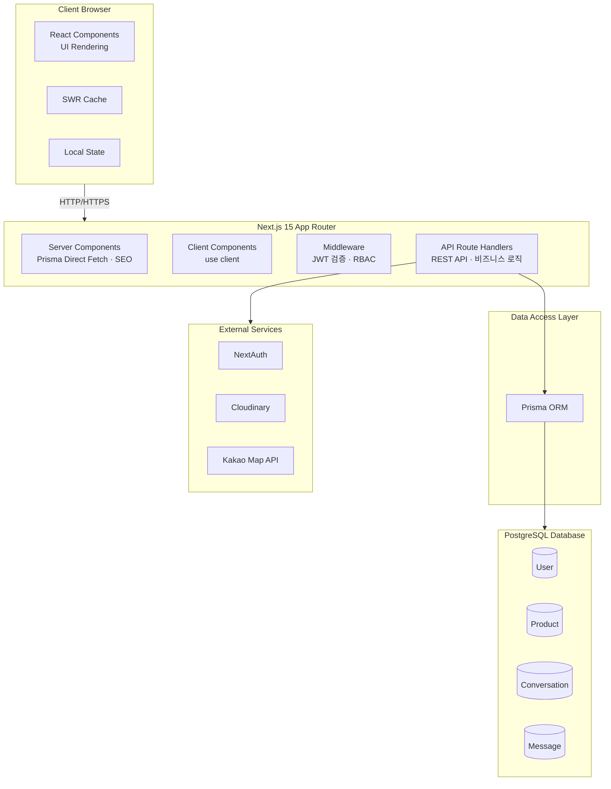

### 1-2. 데이터 플로우 다이어그램

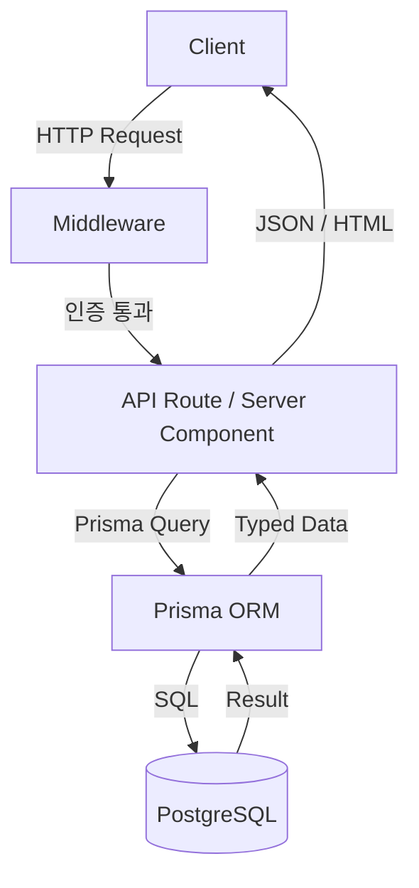

### 1-3. 시퀀스 다이어그램 (로그인 · API 인증)

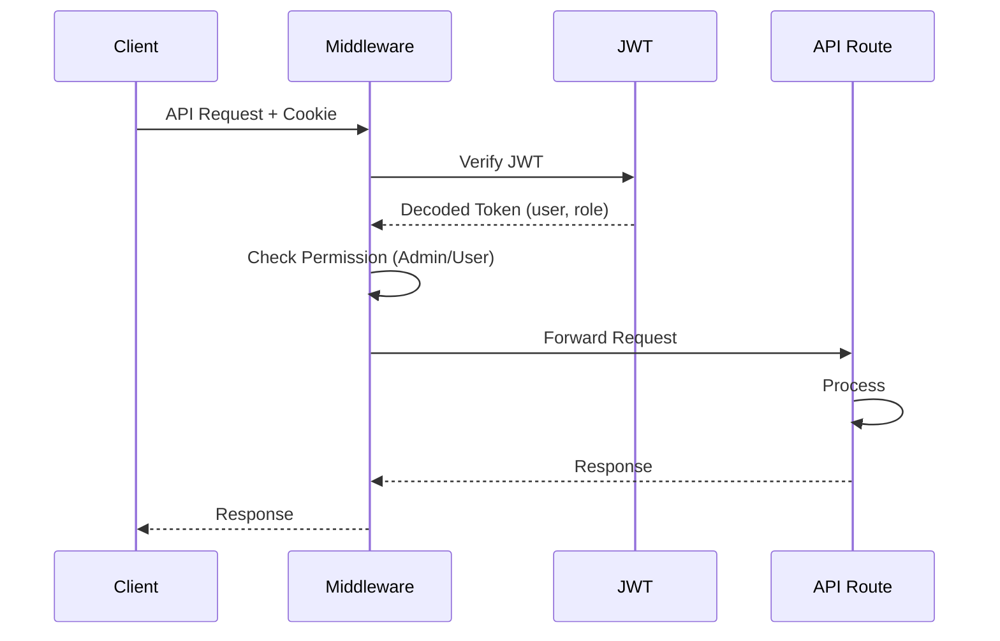

---

## 2. getCurrentUser 중복 호출 최적화 아키텍처

### 2-1. 문제 요약

| 구분 | 내용 |
|------|------|
| **문제** | Layout, Home, ProductDetail 등에서 동일 요청 내 `getCurrentUser()`가 여러 번 호출되어 DB 쿼리 중복 발생 |
| **해결** | `React.cache()`로 `getCurrentUser`를 감싸 동일 요청 내 첫 호출 결과를 메모이제이션 |
| **결과** | 동일 요청 내 getCurrentUser 호출 및 DB 쿼리 감소 (여러 번 → 1회) |

---

### 2-2. Before: 최적화 전 아키텍처

동일 HTTP 요청 내에서 각 컴포넌트가 독립적으로 `getCurrentUser()`를 호출하여 DB 쿼리가 중복 발생합니다.

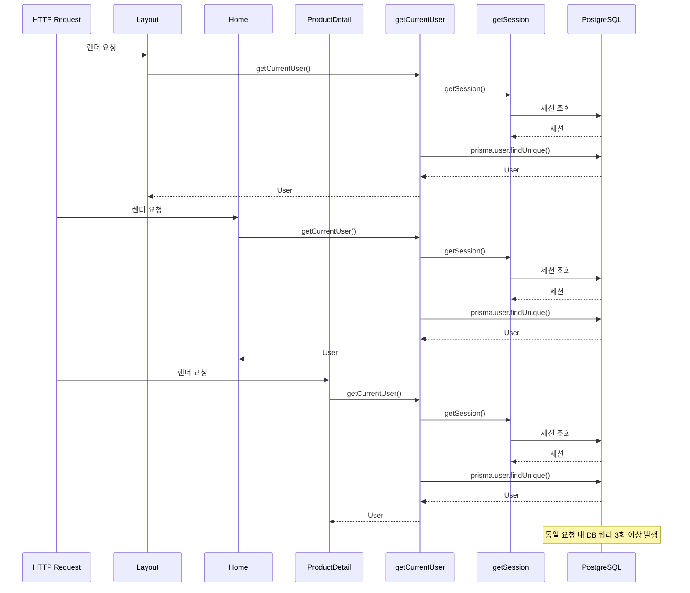

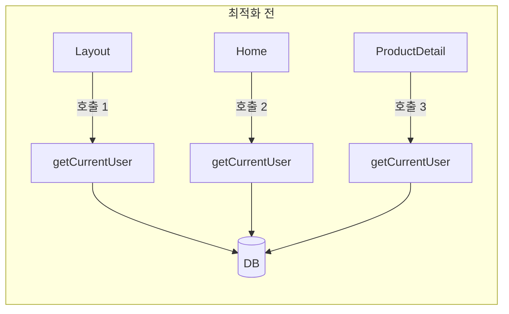

---

### 2-3. After: 최적화 후 아키텍처

`React.cache()`로 감싼 `getCurrentUser`는 동일 React 렌더 패스(요청) 내 첫 호출 시에만 DB를 조회하고, 이후 호출은 캐시된 결과를 반환합니다.

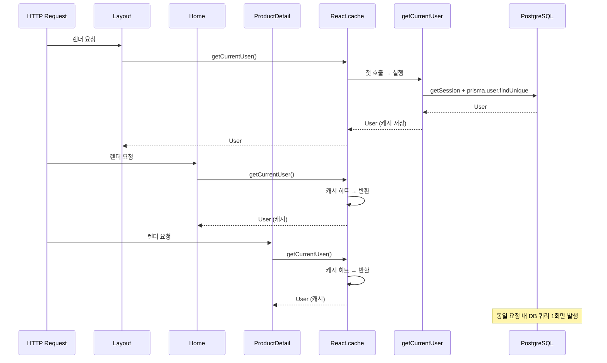

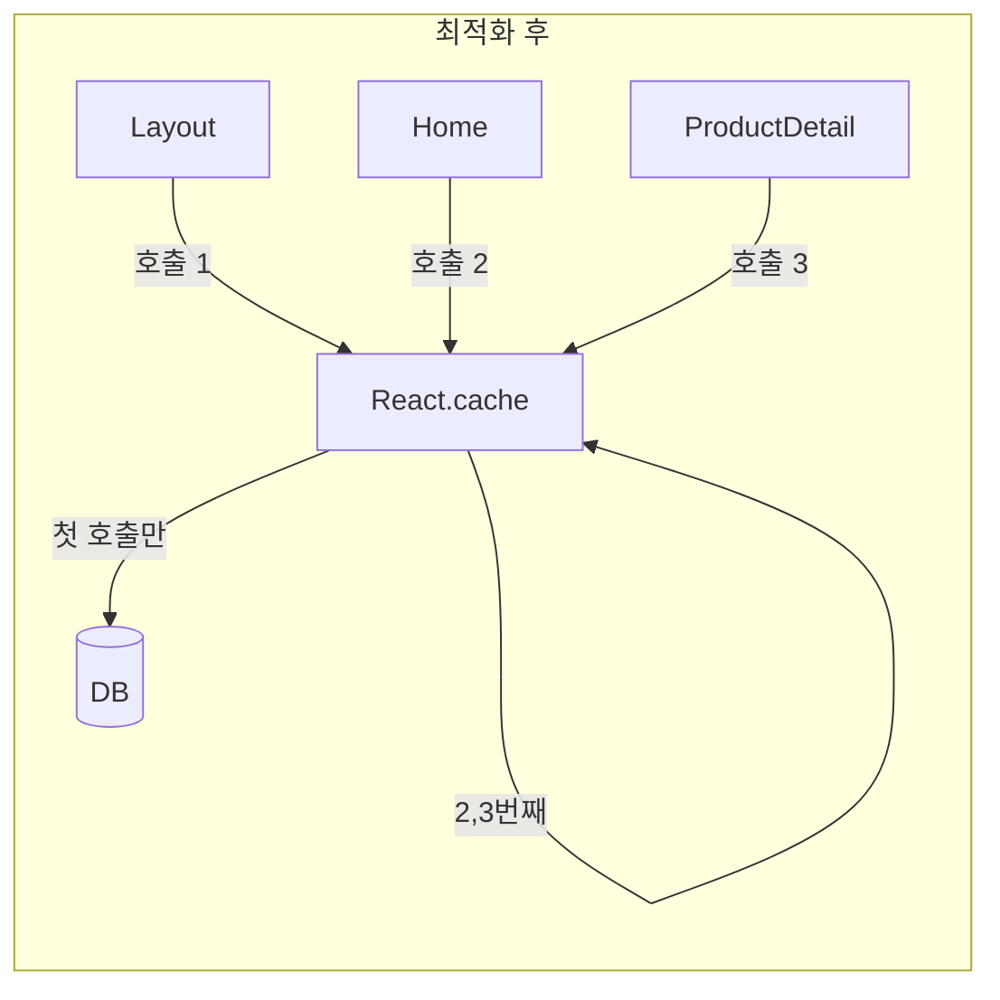

### 2-4. getCurrentUser 내부 구조 (최적화 적용)

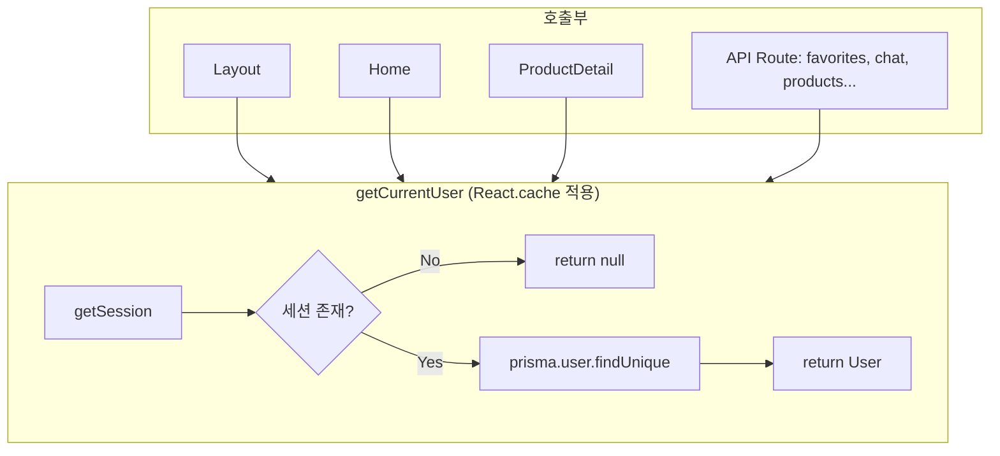

---

## 3. 채팅 API 데이터 과다 로드 최적화 아키텍처

### 3-1. 문제 요약

| 구분 | 내용 |
|------|------|
| **문제** | GET /api/chat에서 전체 유저 + 전체 대화를 조회해 유저 수 증가 시 응답 데이터 과다 및 DB 부하 |
| **해결** | currentUser가 참여한 대화만 `conversation.findMany`로 조회 후, 프론트엔드 형식(User[])으로 변환하여 반환 |
| **결과** | 응답 데이터 크기·DB 쿼리 부하 감소, 채팅 기능 정상 동작 유지 |

---

### 3-2. Before: 최적화 전 아키텍처

`user.findMany()`로 전체 유저를 조회하고, 각 유저의 conversations·messages를 include하여 현재 로그인 유저와 무관한 데이터까지 모두 로드합니다.

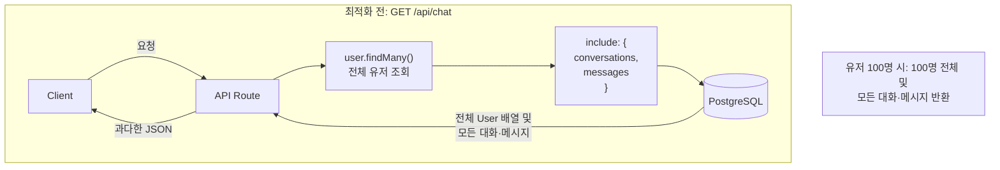

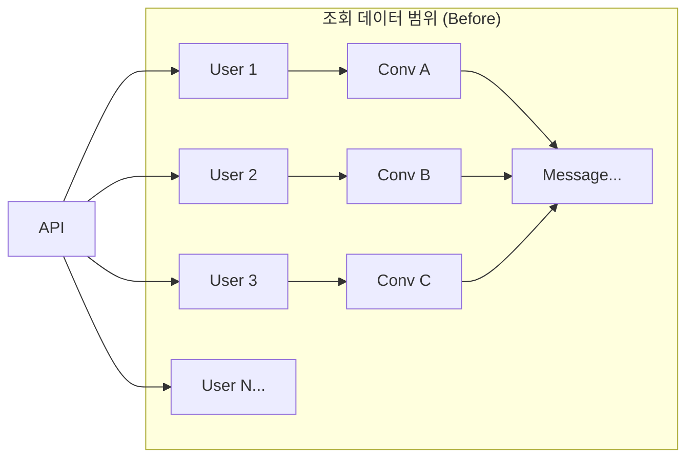

---

### 3-3. After: 최적화 후 아키텍처

`conversation.findMany`로 currentUser가 참여한 대화만 조회한 뒤, 프론트엔드가 기대하는 `User[]` 형식으로 변환하여 반환합니다.

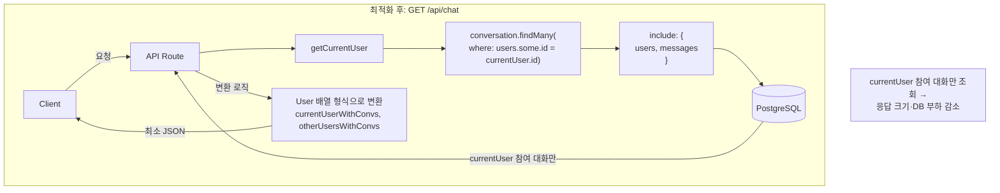

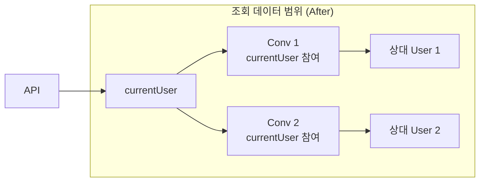

---

### 3-4. 데이터 변환 플로우 (conversations → User[])

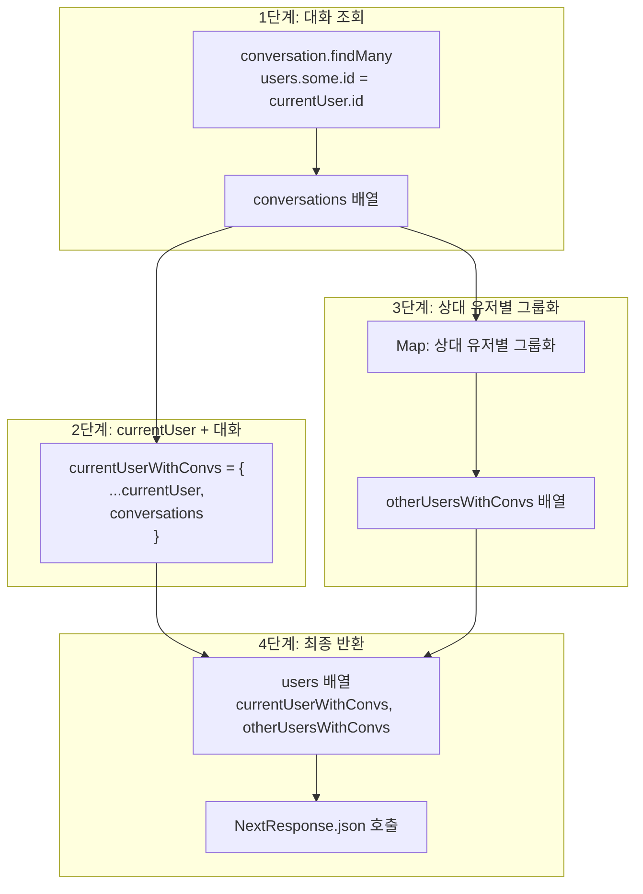

### 3-5. Before vs After 비교 시퀀스

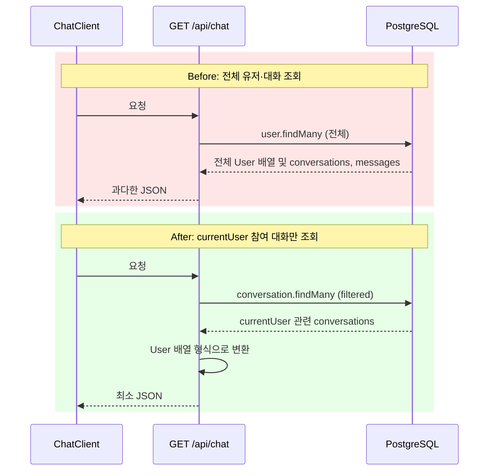

---

*작성일: 2025*
